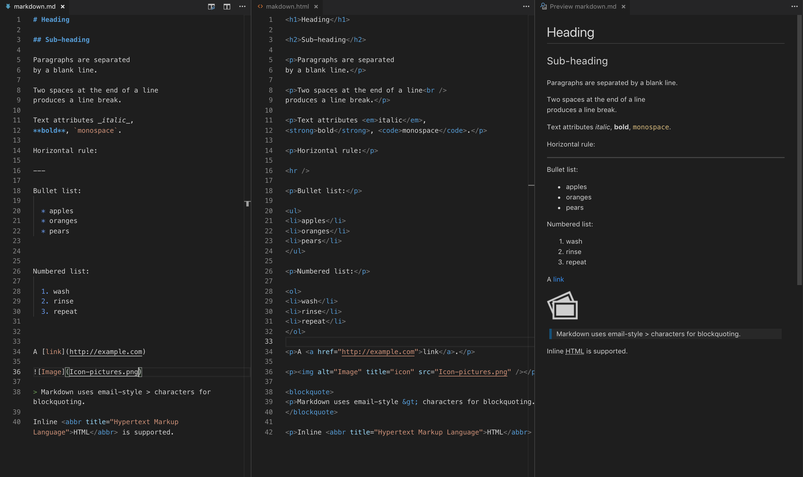

# Markdown

Markdown is a lightweight markup language with plain text formatting syntax. Its design allows it to be converted to many output formats, but the original tool by the same name only supports HTML.[8] Markdown is often used to format readme files, for writing messages in online discussion forums, and to create rich text using a plain text editor. 

## Example

source: https://en.wikipedia.org/wiki/Markdown

&copy; clbo@kea.dk 03-01-2019 